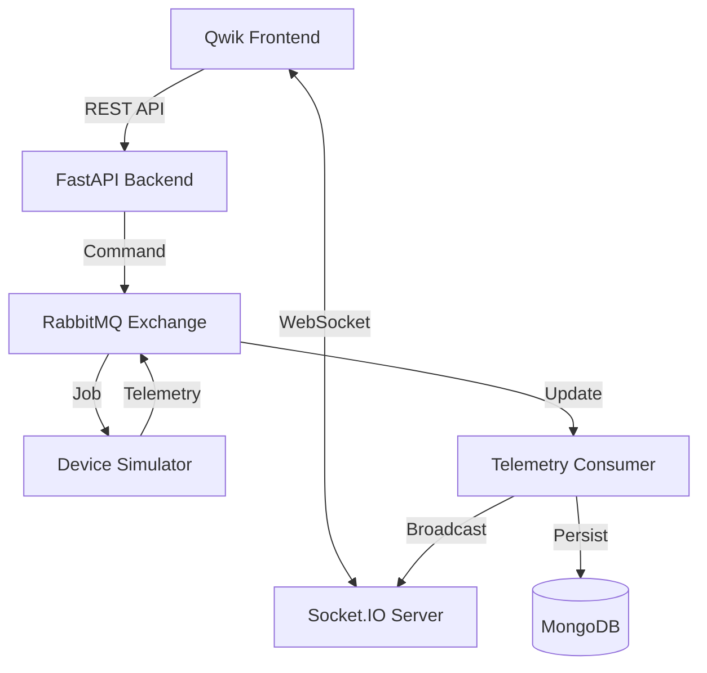

# Apple Digital Twin Project

A modern digital twin management system for Apple products and services. This project uses a high-performance **Qwik** frontend and a robust **FastAPI** backend with **MongoDB**.

## 🚀 Quick Start (Development)

The easiest way to develop this project is using the automated workflows or manual local setup.

### 🤖 Using AI Workflows

If you are using an AI agent (like Antigravity), you can trigger pre-defined workflows located in:
`/.agent/workflows/`

- **`/dev-local`**: Starts the entire stack (DB, API, Frontend) with hot-reload enabled.
- **`/lint`**: Runs project-wide linting and formatting (Ruff for Backend, ESLint/Prettier for Frontend).

---

### 🛠️ Manual Setup

#### 1. Bring the App UP

To start the environment with hot-reload enabled for both frontend and backend:

**Terminal 1 (Database):**

```bash
docker-compose up -d mongodb
```

**Terminal 2 (Backend):**

```bash
cd server
pip install -r requirements.txt
uvicorn main:app --reload
```

**Terminal 3 (Frontend):**

```bash
cd client
npm install
npm run dev
```

#### 2. Bring the App DOWN

To stop all running services and clean up:

1. Press `Ctrl+C` in the Backend and Frontend terminals.
2. Run the following to stop the database:

```bash
docker-compose down
```

---

## 🔗 Access Points

- **Frontend Dashboard**: [http://localhost:5173](http://localhost:5173)
- **API Documentation (Swagger)**: [http://localhost:8000/docs](http://localhost:8000/docs)
- **Backend Health Check**: [http://localhost:8000/api/v1/twins](http://localhost:8000/api/v1/twins)

## 🏗️ Technology Stack

### Frontend

- **Framework**: [Qwik City](https://qwik.dev/)
- **Real-time**: [Socket.IO Client](https://socket.io/)
- **Styling**: Apple Design System (Glassmorphism)

### Backend

- **Framework**: [FastAPI](https://fastapi.tiangolo.com/)
- **Real-time**: [Python-SocketIO](https://python-socketio.readthedocs.io/)
- **Message Broker**: **RabbitMQ**
- **Database**: MongoDB (via Motor)

## 📡 System Architecture



## 📁 Project Structure

```text
PokeCake/
├── .agent/workflows/  # Automated dev scripts
├── client/            # Qwik Frontend
├── server/            # FastAPI Backend
│   ├── simulation/    # Hardware simulator logic
│   ├── services/      # RabbitMQ & Persistent Connections
│   ├── routes/        # API Endpoints
│   └── models/        # Pydantic Schemas
└── docker-compose.yml # Infrastructure Orchestration
```

## ✨ Features

- **Real-time Telemetry**: Live stream of CPU, Temperature, and Battery metrics.
- **Hardware Command & Control**: Bi-directional communication via RabbitMQ.
- **Diagnostic Bursts**: 10-second hardware stress-test with automatic cooldown logic.
- **Premium Aesthetics**: Glassmorphic UI inspired by macOS.
- **Hot Reloading**: Integrated developer experience for all components.
